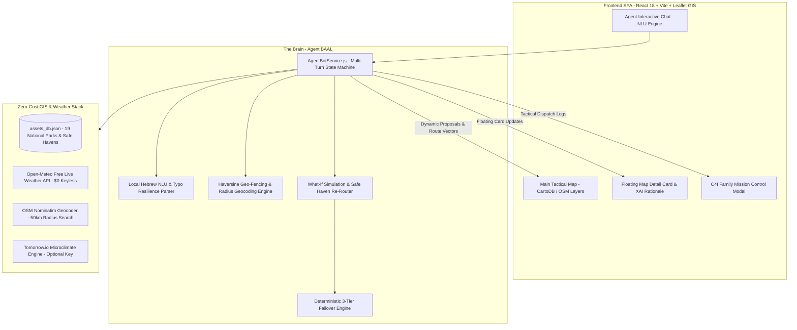

# 🧭 לאן נטייל? // GeoGuard AI
### Autonomous Weather-Adaptive Hiking & Tactical Recommender Agent

[](https://github.com/allavol/Tiyul/actions)
[-emerald?style=flat&logo=cashapp)](https://github.com/allavol/Tiyul)
[](https://github.com/allavol/Tiyul)
[](https://github.com/allavol/Tiyul)
[](LICENSE)

> **"לאן נטייל?"** היא פלטפורמת המלצות טיולים אוטונומית ומערכת שליטה ובקרה (C4I) אזרחית, המבצעת היתוך מידע בזמן אמת בין נתוני מטאורולוגיה ו-OSINT לבין מאפייני שמורות טבע, גנים לאומיים ומסלולי מים בישראל — **תחת מדיניות קשיחה של 0$ עלות תפעולית**.

---

## ⚡ Executive Summary (תקציר מנהלים)

המערכת משלבת את **סוכן הטיולים האוטונומי BAAL** — ארכיטקטורת סוכן היברידית רב-שלבית המשלבת NLU עברי מקומי, מנוע גיאוגרפי מבוסס רדיוס וקואורדינטות (Haversine Formula), מערך Guardrails קשיח (אפס פוליטיקה/אלימות/סמים/ג'יילברייק), ומנגנון ייחודי של **What-If Crisis Re-Planning**: במקרה של שיטפון בזק, שרב כבד או זיהום מים, הסוכן פוסל מיידית את האתר הפגוע ומנתב אוטונומית את המטיילים ל**מקלט בטוח (Safe Haven)** קרוב וממוזג.



---

## 🌟 Key Highlights & Engineering Features (תכונות מפתח)

### 1. 🧠 שרשרת Guardrails ברמת Production
- **סינון קשיח**: חסימה מוחלטת של נושאים פוליטיים, אלימות, סמים, כלי נשק, פריצות פרומפט (Jailbreak / Prompt Injection) ודרישות טיול מחוץ לגבולות ישראל.
- **מענה רב-לשוני**: זיהוי של 5 שפות זרות ומענה בשפת המשתמש המפנה אותו לטיולים בישראל בלבד.

### 2. 🗣️ NLU עברית מקומי ללא עלות (Local Hebrew NLU)
- פירוק ביטויי גיל מגוונים: מספרים ("בן 4"), מילים ("בן שנתיים וחצי", "בת שלוש", "בני שבע"), פעוטות ועגלות (0+).
- ניתוח זמנים ותאריכים: "מחר", "סוף השבוע", "יום שלישי הקרוב", ותאריכי לוח שנה ("25 בספטמבר", "15/10").
- עמידות לשגיאות כתיב (Typo Resilience): זיהוי "גלליל", "מוצאל", "סנפליג" וכיו"ב.

### 3. 🚨 What-If Crisis Re-Planning (ניהול משברים אוטונומי)
- הסוכן מנטר איומים סביבתיים (שיטפונות בים המלח ובמדבר יהודה, שרב מעל 40°C, זיהומי מים).
- בעת אירוע חירום, הסוכן מחשב נתיב מילוט מיידי ומעדכן את המפה עם **וקטור ניתוב מואר** למקלט בטוח סמוך (למשל: עין גדי ➔ גן לאומי בית גוברין / כפר עציון).

### 4. 🧭 מנוע גיאוגרפי מתקדם (Haversine & 50km Radius Search)
- חיפוש מרחבי ברדיוס 50 ק"מ סביב כל נקודה או עיר בישראל (כולל פתח תקווה, ירושלים, באר שבע, חיפה).
- מנגנון Geocoding חופשי דרך OpenStreetMap Nominatim עם Cache מקומי.

### 5. 💎 מדיניות $0 עלות תפעולית (Strict Zero-Cost Architecture)
- שרת מזג אוויר רב-שכבתי: Open-Meteo חינמי ללא מפתחות + Tomorrow.io אופציונלי + הדמיה מקומית Failsafe.
- מפות פתוחות ללא סימני מים ומודלים מקומיים.

---

## 📊 Red Team Audit & Prioritization Plan (דוח ביקורת ותוכנית עבודה)

פרויקט זה עבר ביקורת עומק הנדסית ומוצרית (Red Team Audit) הממופה בפירוט ב-[redteam_audit.html](file:///c:/Projects/Tyul/redteam_audit.html).  
כל המשימות מדורגות ומנוהלות באמצעות מתודולוגיות **RICE** ו-**ICE**:

| ספרינט | מוקד ביצוע | מאמץ (ימי אדם) | ממוצע ICE | תוצר מרכזי |
| :--- | :--- | :---: | :---: | :--- |
| **🚀 Sprint 1** | **Quick Wins & Trust** | ~3.1d | **770** | הסרת מפתחות API, שקיפות מזג אוויר, ביטול Fake Delay, איחוד Haversine, תיקון State Mutation |
| **🏗️ Sprint 2** | **Architecture & Tests** | ~4.7d | **580** | פירוק God Object ל-4 מודולים, בדיקות Vitest, שמירת היסטוריית שיחה, חיבור C4I Modal |
| **✨ Sprint 3** | **UX Polish & Portfolio** | ~7.0d | **350** | קטלוג עיון עצמאי, זמני נסיעה OSRM, תמונות נוף, טיפוסי JSDoc, נגישות ARIA |
| **🧠 Sprint 4** | **Evals & Data Scale** | ~7.0d | **370** | אוטומציית 50 שאילתות Golden Dataset ב-CI, הרחבת המאגר ל-50+ אתרים ומעיינות |

---

## 🛠️ Quick Start & Runbook (מדריך התקנה והרצה)

### דרישות קדם (Prerequisites)
- Node.js (גרסה 18 ומעלה)
- Python 3.9+ (להרצת מודולי הסקילים ובדיקות הבטיחות)

### 1. התקנת תלויות (Install Dependencies)
```bash
npm install
```

### 2. הפעלת שרת הפיתוח (Start Local Dev Server)
```bash
npm run dev
# פתח את הדפדפן בכתובת: http://localhost:5173/
```

### 3. הרצת בדיקות חוסן של הסוכן (Resilience & Anti-Loop Test Suite)
מערך 31 בדיקות קצה המאמתות מניעת לולאות אינסופיות, עמידות ב-30 תורות רצופים, ואימות Guardrails:
```bash
node tests/test_agent_bot_resilience.js
```

### 4. הרצת בדיקות היחידה של הסקילים (Python Skills Suite)
19 בדיקות יחידה להיתוך סיכונים מטאורולוגיים, חישובי Haversine, וניתוב Safe Haven:
```bash
python -m unittest tests/test_skills.py
```

### 5. ביצוע Build לייצור (Production Verification)
```bash
npm run build
```

---

## 📁 Repository Structure (מבנה הפרויקט)

```text
├── assets_db.json                 # מסד נתונים מאומת של 19 אתרים ארציים ומקלטים בטוחים
├── baal.md                        # מסמך אפיון מקיף, ארכיטקטורה, מודל עלויות ומצגת מנהלים
├── agent_validation_plan.md       # תוכנית ולידציה מדעית, 50 שאילתות Golden Dataset ומדדי כיול
├── redteam_audit.html             # דוח Red Team Audit אינטראקטיבי עם לוח RICE/ICE ו-Live Tracker
├── skills/                        # מודולי סקילים אוטונומיים ב-Python (Antigravity Skills)
│   ├── fetch_weather_osint.py     # מנוע היתוך מזג אוויר וסכנות סביבתיות
│   ├── evaluate_asset_risk.py     # מטריצת הצלבת סיכונים ורגישות אתר
│   ├── find_safe_alternative.py   # אלגוריתם אופטימיזציית מקלט בטוח קרוב
│   └── update_c4i_dashboard.py    # פרוטוקול עדכון חמ"ל מבצעי והסברתיות XAI
├── src/
│   ├── components/
│   │   ├── AgentChatBot.jsx       # רכיב הצ'אט האינטראקטיבי עם תמיכה בהדגשות ו-Quick CTAs
│   │   ├── FloatingMapCard.jsx    # כרטיס מידע צף מודרני (Glassmorphism) עם שקיפות מזג אוויר
│   │   ├── AgentOperationsModal.jsx # חמ"ל C4I מבצעי לתחקור והסברתיות
│   │   └── MapView.jsx            # מפת Leaflet טקטית עם פינים מעוצבים ונתיבי ניתוב
│   ├── services/
│   │   ├── AgentBotService.js     # ליבת הסוכן: NLU, מנוע גיאוגרפי, וסימולציות What-If
│   │   └── WeatherService.js      # שירות מטאורולוגי רב-שכבתי (Open-Meteo Free + Tomorrow.io)
│   └── utils/
│       ├── geoUtils.js            # ספרייה קנונית יחידה לחישובי Haversine וזמני נסיעה
│       └── weatherUtils.js        # עזרי אקלים, דרגות עומס חום ואזהרות בריאות
└── tests/
    ├── test_skills.py             # 19 בדיקות יחידה ב-Python
    └── test_agent_bot_resilience.js # 31 בדיקות חוסן של הסוכן ב-Node.js
```

---

## 📜 רישיון ותרומה

פרויקט זה פותח תחת רישיון MIT. למידע נוסף, ראה מסמך האפיון המלא ב-[baal.md](file:///c:/Projects/Tyul/baal.md).
